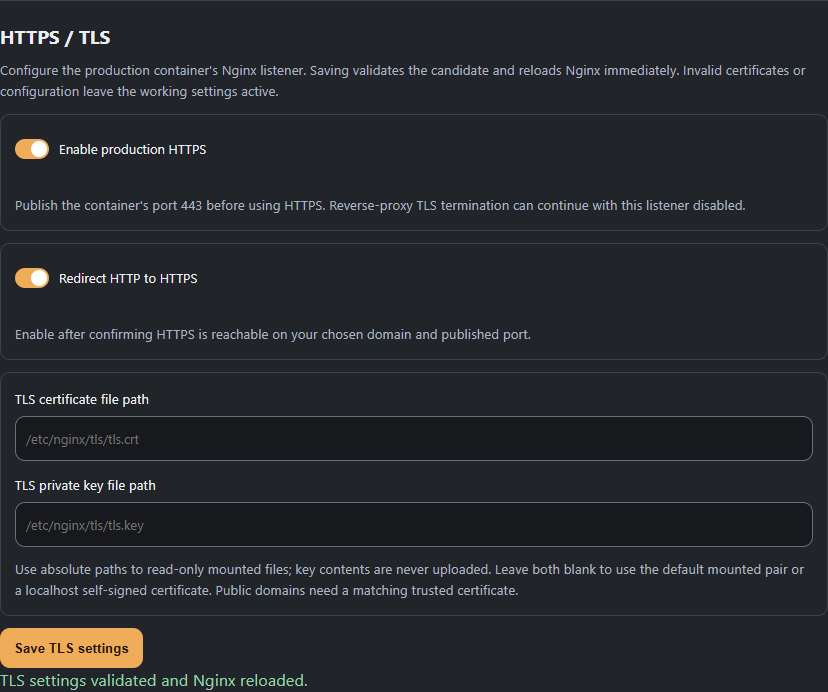
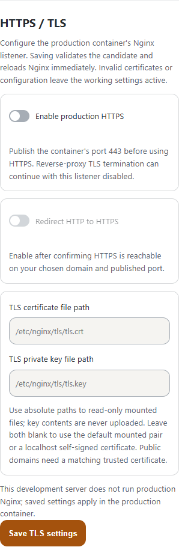
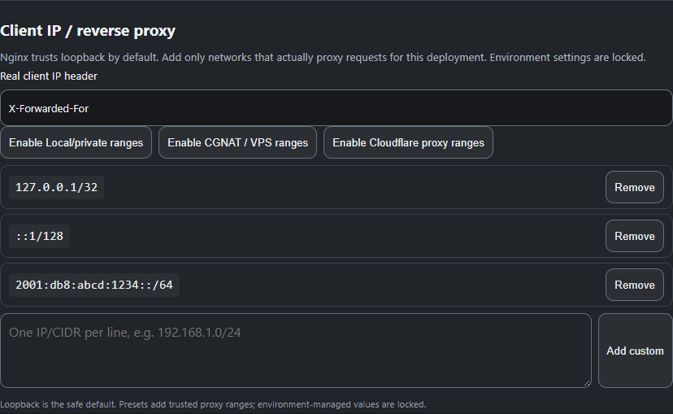
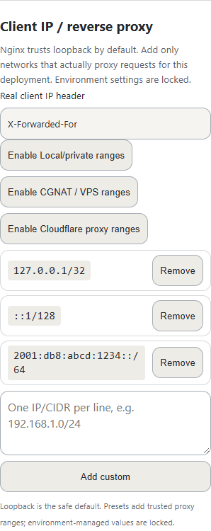

# Production Docker Image

The production deployment is an additional packaging target under `src/docker-container/`. It does not replace the existing development frontend/backend images.

## Architecture

The image is built in stages: Node 22 compiles the Vue frontend, while the runtime image contains Python 3.12, FastAPI, Nginx, the compiled frontend, and the independent startup/diagnostic layer.

The request path is:

```text
Client -> Nginx -> FastAPI
             |
             +-> compiled Vue frontend
             +-> startup/diagnostic files
```

FastAPI listens on `127.0.0.1:8000`; it is not exposed directly by the container.

## Startup and health semantics

PID 1 starts the diagnostic Nginx configuration first, then waits for PostgreSQL, runs Alembic migrations, starts FastAPI, selects the production Nginx configuration (`ready.conf`, `readytls.conf`, or `readytlsredirect.conf`), validates it, copies the selected/rendered configuration to `/etc/nginx/nginx.conf`, reloads Nginx, and verifies the frontend.

The status model distinguishes starting, database failure, migration failure, backend failure/timeout, frontend/Nginx failure, readiness, and post-start backend crash.

The Docker healthcheck is healthy only when `/_startup/status.json` reports `overall=ready`. Therefore:

- Nginx alive + application starting = unhealthy
- Nginx alive + database/migration/backend failure = unhealthy
- application fully ready = healthy
- backend crashes after readiness = unhealthy

The diagnostic Nginx listener intentionally remains available during startup failures.

## Shutdown

PID 1 handles SIGTERM/SIGINT, sends SIGTERM to FastAPI, waits for it, then asks Nginx to quit. This is intended to give active requests a normal shutdown path without leaving orphaned child processes.

## Plugin Runtime isolation

Production Compose also defines a separate plugin-runtime service for the
Plugin Manager. Set `PLUGIN_RUNTIME_TOKEN` to a random value of at least 32
characters; it is passed only to the application and runtime services for
their authenticated internal transport.

The application joins a dedicated internal gateway network so it can reach the
runtime. The runtime has no membership in the core application/database
network, no host port, no core environment or application volume, and no
Docker socket.

Container hardening includes a non-root user, read-only root filesystem,
temporary filesystem only for /tmp, dropped Linux capabilities,
no-new-privileges, and bounded PID/CPU/memory resources.

Inside that container, each plugin is launched by the runtime supervisor in
its own bubblewrap namespaces and process group with independent CPU, memory,
file-descriptor and child-process limits. Plugin subprocesses receive a
fresh environment and cannot receive core secrets.

Outbound plugin networking is default-deny. The plugin sandbox has no direct
network namespace access. Approved external traffic uses runtime-owned,
narrowly validated senders rather than unrestricted network sharing. The
reference Discord provider additionally requires
`PLUGIN_RUNTIME_DISCORD_EGRESS=true`; its host/path and payload size are
validated by the runtime.

The host enforces authenticated gateway access and capability grants. Plugin browser traffic is served through the application and is never published directly from the runtime.

## Permissions and filesystem

Nginx workers run as `www-data`; the master retains the privileges required to bind ports 80/443 and control the process. Runtime status/log files are under `/run/unnamed-tracking`.

The Compose example persists `./data:/data` and PostgreSQL state in a named volume. Runtime diagnostics are ephemeral. Use Docker logging or an external collector when durable logs are required.

## Logging and diagnostics

The production container uses Docker stdout/stderr rather than an application-specific log aggregation system. Use `docker logs <container>` or `docker logs -f <container>` for lifecycle, backend, and Nginx diagnostics.

The backend log is also retained at `/run/unnamed-tracking/backend.log` and migration output at `/run/unnamed-tracking/migration.log`. Retrieve them with `docker exec <container> cat /run/unnamed-tracking/backend.log` and `docker exec <container> cat /run/unnamed-tracking/migration.log`, or copy them with `docker cp <container>:/run/unnamed-tracking/backend.log ./backend.log`. Raw logs are not exposed as public `/_startup` HTTP resources.

The startup page deliberately shows concise lifecycle status instead of raw logs. This keeps normal startup readable while preserving detailed failure diagnostics for operators.

## Startup diagnostics

It displays the lifecycle phase, database status, migration status, backend status, frontend status, and the current message. On failure the loading indicator stops and the failure state is shown. Raw logs are deliberately not displayed by default.

Diagnostic endpoints are `/_startup/status.json` and `/_startup/details.txt`. Raw backend and migration logs are not public HTTP resources.

The startup JavaScript polls asynchronously and slows down after READY. When a failure is reported, the loading animation stops and concise diagnostic details open.
## Optional embedded TLS

HTTP-only remains the default. Administrators configure production TLS under **Settings → Administration → Application → HTTPS / TLS**, during setup, or through the existing environment registry. Environment values lock their corresponding fields. Saving in the production container validates a candidate with `nginx -t`, atomically activates it, gracefully reloads Nginx and confirms the new workers before committing settings. Invalid configuration, failed activation or a failed database save restores the previous configuration. No Docker socket or full application restart is needed.

Saving TLS settings also activates renewed mounted certificates when their paths are unchanged. There is no separate reload button. Certificate and private-key paths have separate labeled fields; contents are never uploaded. Paths must be absolute and free of directive/shell syntax. Supply both paths together. Saved settings survive container restart, and the healthcheck follows HTTP-to-HTTPS redirection. The development stack can save settings for production but does not run the embedded Nginx listener.

When TLS is enabled, the container selects `readytls.conf` or `readytlsredirect.conf` before replacing `/etc/nginx/nginx.conf`. If `NGINX_TLS_CERTIFICATE` and `NGINX_TLS_PRIVATE_KEY` are empty, a complete `/etc/nginx/tls/tls.crt` and `/etc/nginx/tls/tls.key` pair is used automatically when present; otherwise a self-signed localhost certificate/key pair is generated under `/run/unnamed-tracking/tls`. Explicit certificate/key paths remain supported for production. TLS is disabled by default.

| Variable | Default | Meaning |
| --- | --- | --- |
| `NGINX_TLS_ENABLED` | `false` | Enable the embedded HTTPS listener. |
| `NGINX_TLS_CERTIFICATE` | empty | Optional PEM certificate/chain path; the conventional `/etc/nginx/tls/tls.crt` is detected automatically when present. |
| `NGINX_TLS_PRIVATE_KEY` | empty | Optional PEM private-key path; the conventional `/etc/nginx/tls/tls.key` is detected automatically when present. |
| `NGINX_TLS_REDIRECT_HTTP` | `false` | Redirect HTTP to HTTPS after readiness. |

When enabled, publish container port 443 and mount the certificate directory read-only. Do not bake keys into the image.

Confirm external HTTPS access before enabling HTTP redirection. Changes to container environment variables require container recreation; unlocked settings changed through the app reload immediately.





`AUTH_COOKIE_SECURE=true` should be used when the public application URL is HTTPS. Nginx sends `X-Forwarded-Proto` and Uvicorn accepts that header only from the local proxy, preserving HTTPS for request-derived OIDC callback URLs.

If TLS is enabled but the certificate/key is missing, unreadable, malformed, or mismatched, Nginx validation fails and startup reports a frontend/configuration failure. Because the startup configuration remains HTTP-only until the production handoff, the diagnostic page remains reachable during this failure.

## Client IPs behind reverse proxies

Production Nginx restores the originating client address when the request comes through a trusted reverse proxy. The default configuration uses `X-Forwarded-For` with recursive real-IP processing, but only loopback is trusted initially. Settings/setup provides explicit Cloudflare, local/private, CGNAT/VPS, and custom range controls. Nginx only accepts the forwarded address when the immediate peer is in the trusted-proxy set; with recursive processing enabled it selects the last non-trusted address in the forwarded chain. This prevents an arbitrary direct client from making a forwarded header authoritative. See the [NGINX real-IP module documentation](https://nginx.org/en/docs/http/ngx_http_realip_module.html).

The built-in trusted set is deliberately limited to IPv4/IPv6 loopback (`127.0.0.1/32` and `::1/128`). Cloudflare, local/private, CGNAT/VPS, and custom ranges are opt-in through Settings/setup. The backend owns the preset definitions, and the combined production container asks the backend for the effective configuration before rendering Nginx.

Application settings and setup show one removable row per trusted address/CIDR, with long values wrapped. Paste custom entries one per line; the backend validates and canonicalizes them before adding them, rejecting malformed IPs or subnet sizes. Presets do not duplicate existing rows. Removing all saved entries explicitly trusts no proxy addresses. Proxy changes use the same immediate production validation/reload path as TLS changes.

Quick-add buttons remain available for local/private, CGNAT/VPS and Cloudflare ranges. Each added range can be removed independently before saving.





Environment values take precedence over saved Settings/setup values:

| Variable | Default | Meaning |
| --- | --- | --- |
| `NGINX_REALIP_HEADER` | `X-Forwarded-For` | Request header Nginx uses as the source of the client address. For Cloudflare-specific deployments, `CF-Connecting-IP` can be used. |
| `NGINX_REALIP_TRUSTED_PROXIES` | Loopback only | Space-separated addresses/CIDRs. A non-empty environment value overrides the saved/default list; when unset, Settings/setup can persist the selected ranges. |

For a deployment behind a known proxy/load-balancer network, set `NGINX_REALIP_TRUSTED_PROXIES` to only the ranges that can actually reach the container. Do not use a blanket public range merely to make forwarded client addresses appear correct.

## Logs and operations

Startup details and backend startup output are stored under the ephemeral runtime status directory. Nginx logs remain container-local unless exported by the runtime. Operators should use the container logging driver or a centralized collector for durable retention and rotation.

Persist application and PostgreSQL data independently from logs. Backups should be tested against the actual deployment’s persistent volumes.

For small deployments, start around 2 CPU cores and 2 GiB RAM and size upward based on observed application and PostgreSQL workload.

## CI scope

The separate production-runtime smoke workflow validates startup, database migration, login and backend failure states against a real PostgreSQL container.

Database credentials supplied through the individual `POSTGRES_*` values may
contain reserved characters. The backend encodes them for its connection URL,
and the migration environment preserves those percent escapes when passing the
URL through Alembic's configuration parser. An encoded password must not prevent
a fresh container from migrating or starting.

## Persistence

The production Compose deployment persists application data through ./data:/data and PostgreSQL data through the named pgdata volume.

Do not remove these storage locations when recreating the production container.

## CI and publishing

.github/workflows/docker-container.yml builds the production image on pull requests and pushes images for non-pull-request events. For non-PR events it pushes both a ref-derived tag and a sha-<commit> tag to GHCR.

The image-build workflow validates the image and Nginx configuration. The separate production-runtime smoke workflow exercises startup, migration, login and backend failures with PostgreSQL.

## Secrets

Backend and migration output passes through credential redaction before Docker forwarding and private log retention. Public startup details contain concise lifecycle status and operator log paths; raw logs are not published as HTTP resources.


The production-container workflow builds the image and validates Nginx/TLS configuration with deterministic self-signed test material. The separate production-runtime workflow covers application startup, PostgreSQL migrations, login, JSON API responses and backend failure states.

## Upload transport

Embedded Nginx forwards upload bodies to the application instead of applying its
default 1 MB ceiling. The host still enforces each saved image/file, clip, save
archive, world-save and plugin-package limit. This keeps administrator overrides
and large supported archives usable and returns native JSON validation results.
HTTP and HTTPS use the same limits; operator backend/migration logs remain private
in both modes. An additional external proxy must allow the configured upload size.
