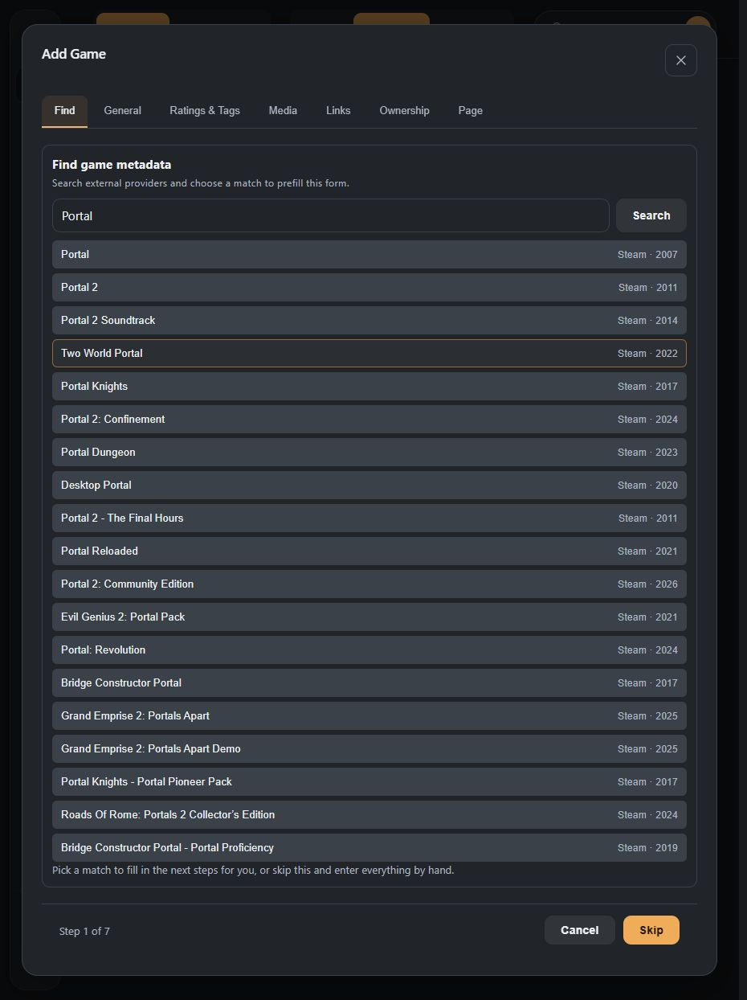
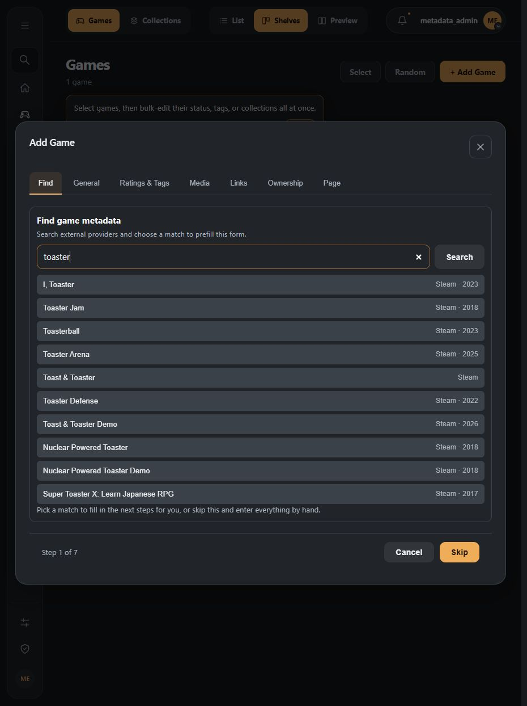
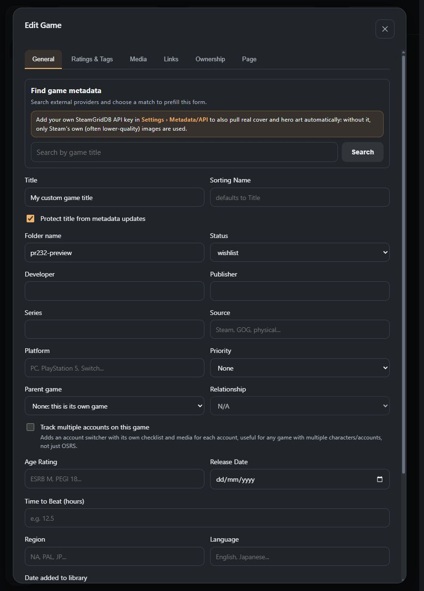
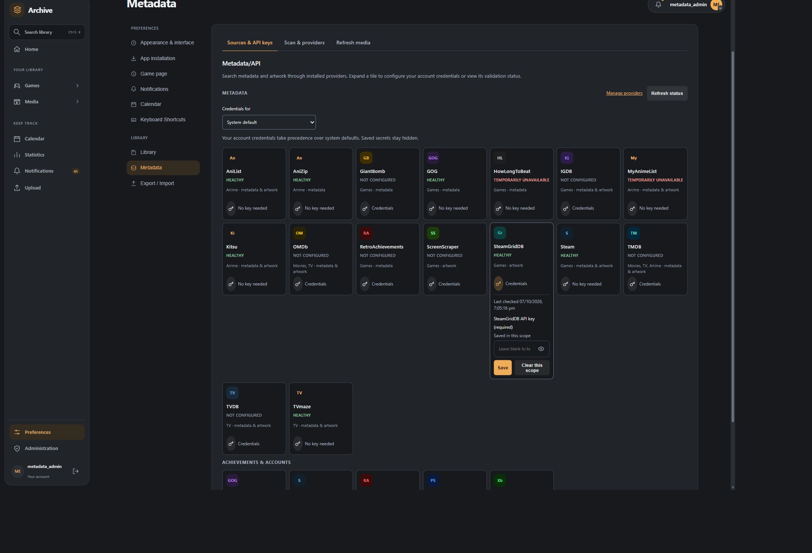
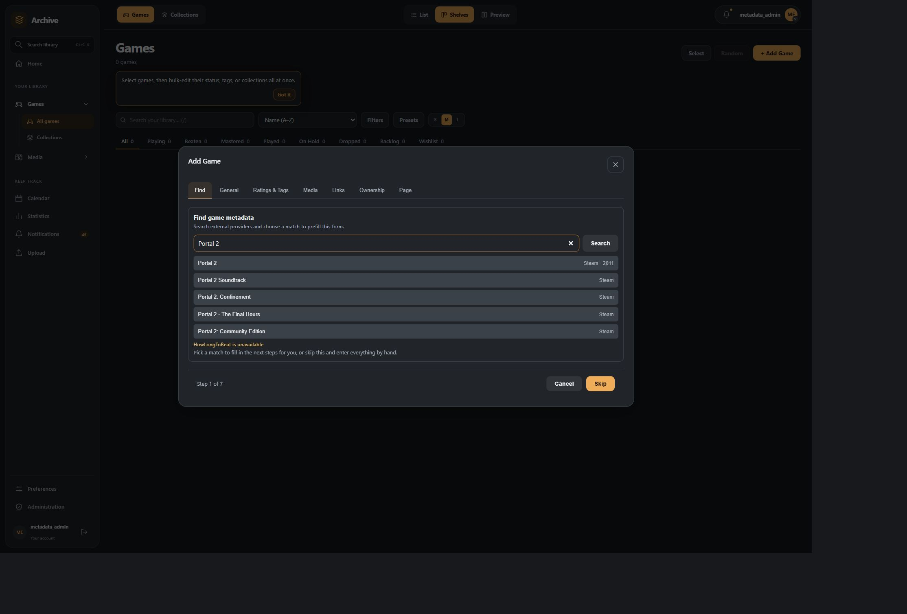
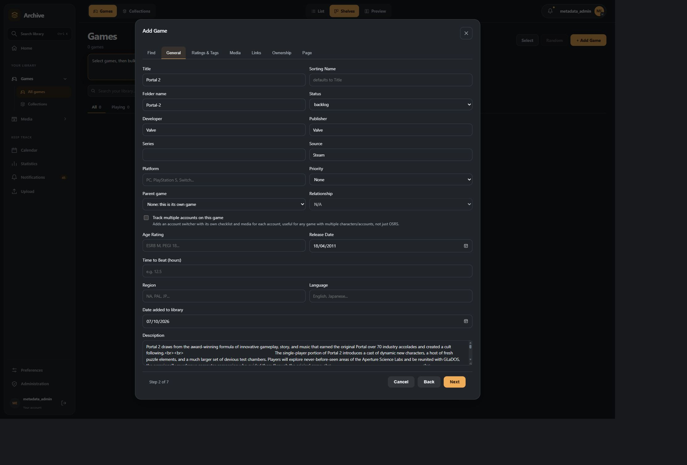
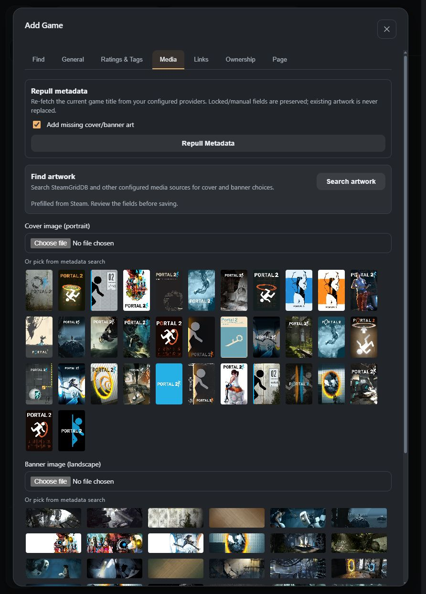
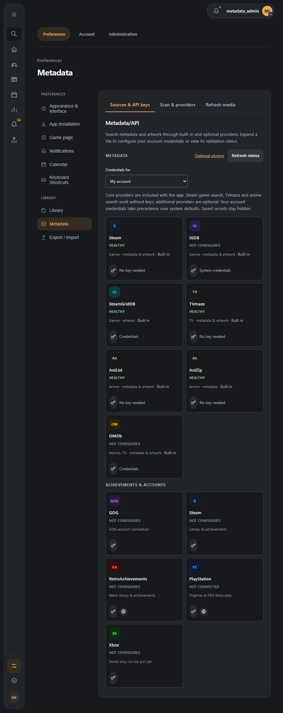
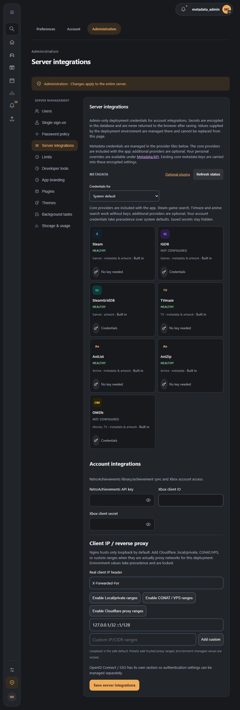
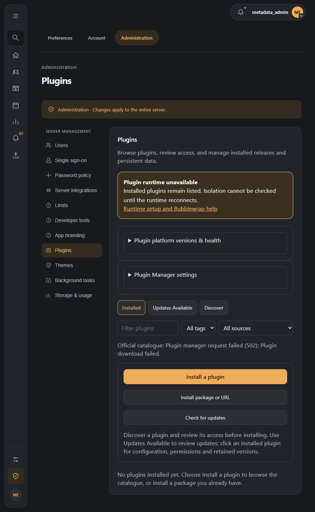

# Metadata providers

While refining or backspacing a query, matching results retain preloaded text
and release years until fresh nonempty provider values arrive. Selecting a
retained result keeps those fields in the preview. Artwork comes from the
current selection; an unselected result does not reuse old artwork.

Unnamed Tracking App includes hardcoded Steam, IGDB, SteamGridDB, TVmaze, AniList, AniZip and OMDb providers. Steam game search, TV and anime search work without installing plugins. Optional provider plugins can extend the suite. Search results arrive progressively; from five query characters, up to five metadata fetches run concurrently from the top down. Each completed fetch starts the next while the query stays unchanged. Text patches update the result's year as they arrive. Artwork starts after selection. Configure the built-in providers through **Settings → Metadata/API**. Install optional providers through Plugin Manager. Provider order and field-saving preferences remain per user.

The final text-only verification searched `toaster`, `Portal 2` and `Half-Life`
without selecting results. All 29 results with a supplied release year displayed
it, including entries beyond the initial five; all 30 results had zero artwork
assets. `Toast & Toaster` supplied "Coming soon" without a year, so its year
remained blank. That check kept each query unchanged. The query-change regression
reported in [issue #6](https://github.com/obsoletelabs/unnamed_tracking_app_2/issues/6)
is covered by the retained metadata behavior above.

## Protect a title

Edit a game, movie, TV show, or anime and use **Protect title from metadata
updates** beside its title. A checked box means the title is protected. Changing
a title automatically protects it; clear the checkbox to explicitly remove
protection, then save. You can also protect a title without editing its text.

Protection applies on the backend to providers, library sync, imports, and
background refreshes. Only an authenticated application sign-in session may
change a protected title or its protection setting. API keys and ordinary plugin
permissions cannot unlock it. For anime, a protected custom title takes precedence
over the provider's alternate-language spellings.

## Repull metadata from the game editor

Open **Edit Game → Media → Repull Metadata**. The editor first performs a provider lookup and shows a confirmation describing the fields that would change and any locked fields that will be preserved.

The refresh uses the current game title and requires an exact title match (ignoring case and common trademark/copyright marks). A fuzzy or missing match is not applied.

The workflow is:

1. Choose whether missing cover/banner artwork may be added.
2. Click **Repull Metadata**.
3. Review the provider and the fields that would change.
4. Cancel, or confirm **Apply refresh**.
5. The editor reloads the saved game data after a successful refresh.

Existing artwork is never replaced by this editor action. Replacing artwork remains a separate explicit action.

## Manual fields and locked metadata

When a user manually changes a metadata field through the game editor, that field is recorded as a manual override (`locked_fields`). Future provider refreshes skip it. This protects intentional values such as a custom description, developer/publisher correction, tags, release date, or other supported metadata.

Ratings, playtime, ownership information, notes, status, and other personal library state are not part of the provider refresh and are left unchanged.

If a provider does not return a value, the existing value is not cleared.

## Provider selection and priority

The refresh uses the same generic metadata handler as search. Providers run concurrently. The user's provider order determines field authority, while artwork is a separate selected-entity operation. Provider failures are reported without discarding successful results from other providers.

Provider credentials are declared by each built-in or optional provider and configured in the host provider panel. Field-save toggles remain in metadata preferences. The game editor uses that same configuration.

## Provider failures and stale previews

A provider outage, rate limit, malformed result, or no-match result does not modify the game. If the game changes after the preview but before applying it, the backend rejects the stale apply with a conflict and the editor asks the user to refresh/retry. This prevents a metadata refresh from overwriting a newer edit made in another tab or session.

Metadata changes are recorded in the existing game metadata history, so provider-applied field changes remain visible in the game's **History** tab.

## Developer notes

The editor uses `/api/game/{game_id}/metadata/refresh`, which resolves an existing
library identity through `features.metadata.service` and the shared handler.
The endpoint retains authorization, exact-match validation, field protection,
history, artwork and stale-preview checks. Applying a refresh reloads the owned
row under a lock, so a protection change during lookup is respected.

See [Progressive metadata and Plugin API 1.1.1](../development/metadata-providers.md)
for the public contract, session endpoints and migration details. Provider
optional implementations are maintained in [obsoletelabs/unnamed_tracking_app_plugins](https://github.com/obsoletelabs/unnamed_tracking_app_plugins).

## Where keys go

Open **Settings → Metadata → Sources & API keys**. Administrators can also use
the same provider tiles in **Server integrations**, with System default selected. Fields declare system, user or both scopes. Administrators
may save system values; users may save their own values. A user override wins over
a system fallback when both scopes are supported. Reads show configuration presence
and health, never stored values. Clearing a user override restores the system fallback.
Configuration queues immediate validation; periodic validation defaults to 30 minutes.

Existing IGDB, SteamGridDB and OMDb core keys are carried into missing encrypted
provider scopes. Existing new settings and explicit clears are preserved. Optional
plugins do not receive legacy host keys automatically. Existing Steam,
RetroAchievements and console account-sync credentials remain in account integrations.
IGDB declares system Twitch credentials; other providers declare their own scopes.
TMDB is optional and may be left unconfigured. TVmaze and public anime providers
operate without signup. Movie sources require a configured movie provider such as OMDb.

## Familiar interface, progressive results

The source panel retains the original compact tiles, colored monograms, key
buttons and expandable credential forms. The seven built-in tiles are always
available; installed optional plugins add their own tiles. Each shows its current health; expand a tile for the last validation time
and saved-value presence. Administrators choose **System default** for shared
credentials or **My account** for a personal override. Changing scope clears
unsaved input so it cannot be saved accidentally to the other scope. The original
account-import connections remain below the metadata tiles.

The Add Game editor retains its Find, General, Ratings & Tags, Media, Links,
Ownership and Page tabs. Identity results appear before artwork; failed optional
providers produce a short warning while successful results stay selectable.
Selecting a result populates the existing fields and starts artwork lookup.

These screenshots were captured on 2026-10-07 using the built-in core providers
and a disposable development library with no installed plugins. They demonstrate Steam and SteamGridDB live data;
they do not imply that every authenticated provider has been configured or validated.

## Safe operation

- Keep secrets out of screenshots, logs, browser storage and repositories.
- Metadata credentials use the application's existing encrypted storage and user/system scopes.
- Native core adapters receive only their resolved credentials; optional plugin actions require their declared grants.
- Disabled and unconfigured optional providers do not produce search warnings.
- Temporary outages and rate limits do not discard successful results.
- Search and selection are previews; review fields before saving.
- Title locks, ownership, personal state and missing-field preservation remain enforced.

## Steam account identifiers and privacy

The Steam connection accepts a full `steamcommunity.com/id/...` or
`steamcommunity.com/profiles/...` link, a vanity name, SteamID64, SteamID2
(`STEAM_0:0:11101`) or SteamID3 (`[U:1:22202]`). Numeric identifiers are converted
locally; vanity names use Steam's profile lookup.

If Steam does not share the library, the connection or sync reports the privacy
problem and leaves existing games unchanged. Set **Profile → Privacy Settings →
Game details** to **Public** and verify the account ID before retrying. An
explicitly empty public library remains a valid empty library.

## Steam tags as genres

Steam's own genres are broad: Elden Ring is only Action and RPG. Steam players
also vote on tags, and those describe a game far better. For Elden Ring the
most voted are Souls-like, Open World, Dark Fantasy, RPG, Difficult and Action
RPG.

With **Use popular Steam tags as genres** on (it is on by default), a Steam
game's genres become its most voted tags plus its official genres, so Elden
Ring gets Souls-like, Open World, Dark Fantasy, RPG, Difficult, Action RPG and
so on. Tags that are not genres are left out: how many play it (Singleplayer,
Multiplayer, Co-op, PvP), how it is controlled (Controller support, VR), what
Steam adds around it (Steam Achievements, Early Access, Free to Play),
opinions (Great Soundtrack, Replay Value), and content labels (Violent, Family
Friendly). At most 12 player tags are kept. A game that players have barely
tagged keeps its official genres only.

The setting is under Settings, Metadata, Scan & providers. It applies:

- when a Steam game is added by a library sync;
- when a game's metadata is searched or refreshed. Because other providers such
  as IGDB can fill the genres first, the Steam tags replace them when the search
  matched a Steam game;
- when you press **Update my Steam games now**, which re-reads the tags of the
  Steam games already in the library. It works through them a few at a time and
  reads one store page a second, so a large library takes a few minutes. Tags you
  added yourself are kept.

The tags are read from each game's public Steam store page, the only place Steam
shows them. If a page cannot be read, the game keeps the tags it has. With the
setting off, Steam games get Steam's official genres as before.

## Core-only installation

The core suite works directly in the app; Plugin Manager may be empty. Steam does
not require a Steam Web API key for metadata. Its account/library credentials
are separate. Movie search needs an OMDb key or an optional movie provider; TMDB
is not required. Core metadata also works while the optional plugin runtime is
unavailable.

The following verification view deliberately stopped the optional plugin runtime.
The inventory is empty; the core search/details/artwork screenshots above were
captured without relying on that runtime. Optional runtime/catalogue failures
remain visible in Plugin Manager.

