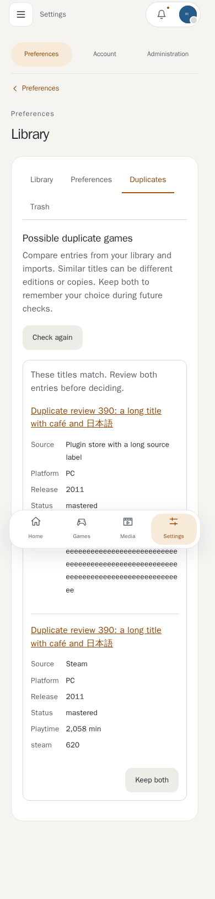
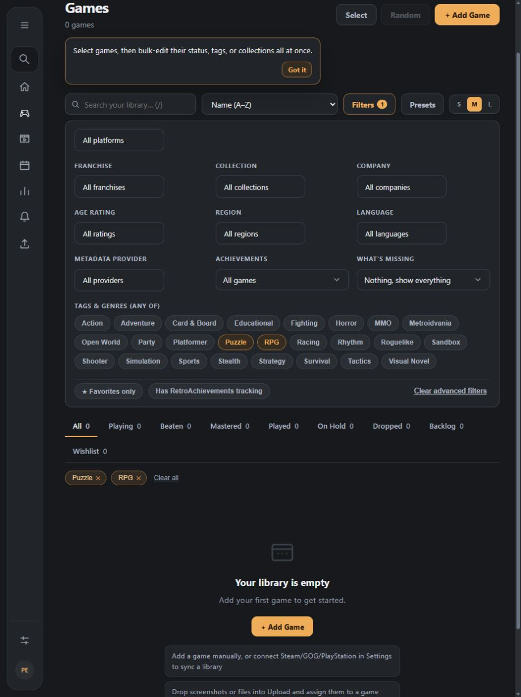

# Games

The game library supports manual records and provider-backed metadata. Use search, filters, collections, lists, bulk edit, and the detail page to organize a library.

Fresh navigation to Games starts at the top. Returning from a game detail preserves the library position once; visiting another section clears it. Media pages keep their loaded data while the router controls fresh navigation and browser history scrolling.

## Adding and editing

Create a game from the library, optionally search configured metadata providers, then review the fields before saving. Editing supports title and sort title, platform, status, dates, rating, genres/tags/features, description, time-to-beat data, and artwork. Field-change history records supported metadata changes.

Bulk edit changes selected records only. Locked fields are not overwritten by refresh operations.

## Possible duplicates

Open **Settings > Library > Duplicates** to compare possible duplicate games across manual entries, Steam, other stores and plugin imports. Suggestions use matching titles or shared provider identities, so a manually renamed game can still be found. Known conflicting years, platforms and provider identities are excluded. Compare each entry's source, release, status, playtime and identities; open its title to inspect notes and files. **Keep both** remembers your decision across future checks and import reruns. Nothing is merged or deleted automatically. **Check again** refreshes the review and shows additional pairs after decisions.

## Steam imports

Steam library sync saves games and achievements before fetching store details and
artwork in small batches. A failed details batch does not discard the imported
library; the sync result reports games whose details could not be fetched.

Owned-library sync skips player achievement requests for games without an
achievement schema. If Steam supplies a schema but no player progress, existing
achievements keep their stored unlock state until a later successful sync.
An explicit player list with every achievement locked is still applied.

Provider settings show each source's active library game count and the time of
its last successful sync. Trashed games are excluded; restoring them returns
them to the count.

Settings > Metadata > Scan & providers includes **Import my Steam wishlist**, off
by default. When enabled, new wishlist entries are added with Wishlist status and
receive store titles and artwork during enrichment. A later owned-library sync
updates a purchased wishlist game's status. Turning the setting off leaves existing
entries in the library. An optional wishlist failure does not prevent owned-game
enrichment.

Library imports match existing games by provider ID. Different provider IDs with
the same title stay separate, while a matching record without a provider ID can
be adopted. Resyncs preserve locked titles. Import folder names are allocated
within your account and fit the storage limit, including collision suffixes.

## Detail-page data

A game can have:

- achievements and achievement progress;
- screenshots, videos, documents, and other uploaded files;
- notes and checklist items;
- player profiles, linked Wise Old Man statistics, and stat history;
- save, config, mod, and world archives with version history;
- rendered world-map previews for supported archives;
- related variants and collection/list membership.

Uploaded files remain user-scoped. Deleted games, files, screenshots, profiles, and archives move to their corresponding trash views when supported and can be restored until purged or swept by retention policy.

Achievement detail pages retain the Games / Collections navigation while loading
or reporting a missing achievement. Use Back to return to the achievement's game.

## Documents and plugins

The core file list allows normal downloads. Plugins with an approved `documents.read` grant can receive only safe document DTOs and supported PDF/plain-text content; they never receive host paths. See [Plugins](plugins.md).

## Adding a game

**+ Add Game** in the Games library walks through the game in steps:

1. **Find**: search the metadata providers by title and pick a match to fill
   in the following steps. Press Enter or **Search** to search. Exact title
   matches are listed first. **Skip** leaves every field for you to fill in.
2. **General**: title, folder name, status, platform, priority and the rest.
   **Next** won't continue without a title and a folder name.
3. **Ratings & Tags**, **Media**, **Links**, **Ownership**: move through them
   with **Next** and **Back**, or click a tab to jump to it.

The game is only created with **Add Game** on the last step. Editing an
existing game shows the same tabs as one form with **Save Changes**.

### Fields worth knowing

| Field | Notes |
| --- | --- |
| Folder name | Letters, numbers, underscores and hyphens only. It names the game's folder on disk, so it must be unique among your games. |
| Source | Where the copy came from (Steam, GOG, physical...). |
| Platform | The system you play it on (PC, PlayStation 5, Nintendo Switch...). Suggestions are offered but anything can be typed. Without a platform, the source is shown instead. |
| Priority | 1 (highest) to 5 (lowest). Finished games (beaten, mastered, played, dropped) are left out of priority sorting and the random picker. |
| Date added to library | Defaults to today. Change it to back-date a game you've had for a while. |
| Region, Language | Edition details, used by the library's Region and Language filters. |
| Currency | Chosen from the currencies the server accepts. |

Clearing a field and saving clears it. A blank sorting name sorts by the
title.

## Filtering and sharing

The Filters panel has one **Tags & genres (any of)** picker. Selected tags are
highlighted there and shown as removable pills above the results. Metadata labels
such as `Genre: Indie` and `Indie` match the same choice. Selecting multiple tags
shows games matching any selected tag; the other filters narrow that selection.

Changing tags, genres, sorting or other query filters on the current page keeps
your scroll position. The URL still updates for sharing. Navigating to another
page starts at the top, and browser back/forward restores its saved position.

The game total reflects the visible results. All and each status tab count games
matching the current search and other filters, so switching status remains useful.
Tabs with no matches show zero.

Copy the browser URL to share the selection, search, status and sort. Multiple tags
use repeated parameters, for example `/games?filters=1&tag=Indie&tag=RPG&status=backlog`.
Opening a shared link replaces saved filters in that browser. Removing a pill or
clearing filters updates the URL too. Existing `?tag=`, `?genre=`, collection and
statistics links remain supported; saved genre selections migrate into the picker.

## Sorting the library

The sort menu offers Name (A–Z and Z–A), Recently added, Rating, Most
played, Recently played, Neglected (least recently played), Priority,
Release date (newest) and Time to beat (shortest). Games missing the value
being sorted on go last. The default sort is set under Settings › Appearance & interface.

## Picking something to play

**Pick something random** on Home, or **Random** in the Games library, opens
a picker. Narrow it down by status, platform, genre, the most hours to beat
and priority, then **Pick a game**. With **Favour higher-priority games** on,
a priority 1 game is five times as likely as one with no priority. **Pick
again** never repeats the last pick while there's another choice; when only
one game matches, the picker says so. The filters are remembered in your
browser.

Genre filters, here and in the Games library, match a game whichever
metadata provider named its genre. IGDB, for example, has no "Action" genre
and files Devil May Cry under "Hack and slash/Beat 'em up", which still
counts as Action; "Role-playing (RPG)" counts as RPG and "Platform" as
Platformer. Letter case doesn't matter.

## Bulk edit

**Select** games in the library, then **Bulk Edit** to set status, favorite,
developer, publisher, series, age rating, platform, priority, tags or
features on all of them at once. Only the fields you tick are changed.

## A game's page

Clicking a game opens its page. The header holds the cover, title, status,
score, favorite heart and collections button, and below it are the tabs:

- **Overview**: the description, ratings, platforms, links and where you left
  off.
- **Achievements**, **Screenshots**, **Clips**, **Soundtrack**, **Saves**,
  **Docs** and **Notes**. See [Game Media and Files](game-media.md) and
  [Game Notes](game-notes.md).
- **Stats**: playtime and dates, with a history timeline underneath.

Which tabs and header parts show is up to you. See
[Game Page Settings](game-page-settings.md).

A game you have already seen in the library opens straight away and refreshes
in the background.

### Clickable details

The developer, publisher, platform, tags and series on a game's page are
links. Clicking one opens the library filtered to every game with the same
value, so clicking a developer lists all of its games. It shows only that
filter, not on top of the ones left on from last time.

### Genres from Steam tags

A Steam game's genres can come from the tags Steam players vote on instead of
only Steam's broad official genres, so Elden Ring shows Souls-like, Open World,
Dark Fantasy, RPG, Difficult and Action RPG rather than just Action and RPG. See
[Steam tags as genres](../integrations/metadata.md#steam-tags-as-genres).

## Achievements

Steam, PlayStation and RetroAchievements achievements are synced into the
game.

- **Hidden achievements** are flagged by the provider and shown as a spoiler
  until you unlock them. Steam only publishes a hidden achievement's
  description after you unlock it, so locked ones stay blank. Descriptions of
  the ones you have unlocked are read from your public Steam profile, which
  needs your game details set to public. Refresh the game's achievements, or
  run the library sync again, to fill them in.
- **Of players** shows how many players have each achievement (Steam's global
  percentage, PlayStation's earned rate, or RetroAchievements' count).
- Screenshots, clips and notes can be tied to an achievement, and the
  achievement's page lists what is tied to it.

## Stats and history

The Stats tab shows playtime, achievements, score and dates. Below the numbers
is the game's story as a timeline. Each entry has a date and a one line
summary, and opens to show the details. Entries cover being added to the
library, being purchased, achievements unlocked, metadata updated, a price or
status change, and media added. Things that happened together are grouped. The
timeline can be switched off in the page settings while the numbers stay.

## The library at a glance

The library has card, list and shelf layouts. Covers are small local copies
rather than the full artwork, and they load lazily: only the games near the
screen fetch their picture, and the list layouts skip drawing rows that are far
off screen. A library of hundreds of games opens quickly and loads more as you
scroll. See [Artwork](../development/architecture.md#artwork-and-local-image-copies)
for how the copies are made.

## Metadata provider extension (1.1.1)

Search and refresh use the hardcoded core providers and optional installed provider plugins
through one shared metadata handler. Core search does not require the plugin runtime.
Provider configuration and health appear in the host's metadata settings.
See [the progressive metadata contract](../development/metadata-providers.md) for
phase separation, scoped credential migration, deadlines and persistence behavior.
