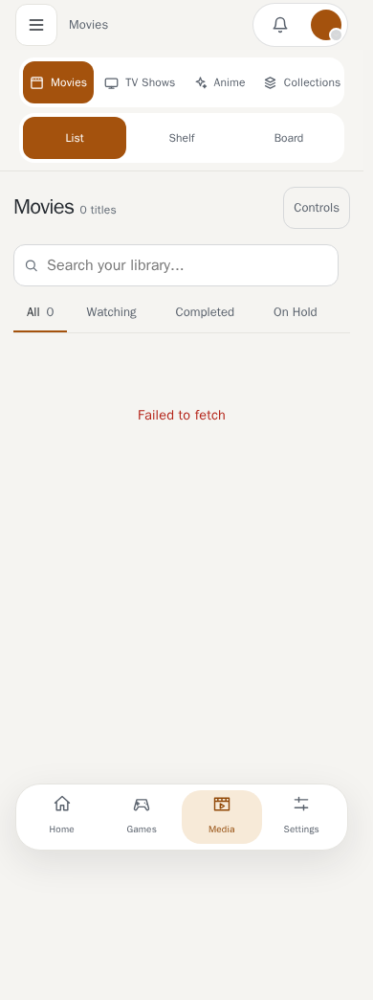
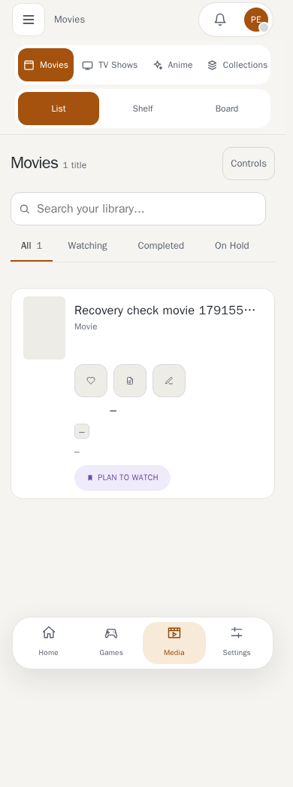

# Movie, TV and Anime Libraries

Status tabs survive a page refresh. Loading the next page keeps the existing cards
on screen and preserves their scroll position. Posters, backdrops and achievement
icons are downloaded into the server's cache when saved, with the original URL used
as a fallback if the download fails. Existing images are cached when first viewed.

After a connection loss, the visible library retries when internet access returns.
If the tab was hidden, it waits until you return. A failed load also retries when
you focus the window again. Successful requests clear the previous error and keep
your selected filters; you do not need to reload the browser page.

The [browser recovery checks](../assets/library-recovery/conformance.json) cover
games, movies, TV and anime at phone and desktop widths, using actual backend
responses after injected connection failures. The same browser document recovers.

| Connection unavailable | Connection restored |
| --- | --- |
|  |  |

[Desktop before reconnecting](../assets/library-recovery/unavailable-1440.png)
and [after reconnecting](../assets/library-recovery/recovered-1440.png).

Yamtrack CSV imports continue to skip anime entries while their mapping and duplicate
matching remain unresolved. Movies and TV shows can still be imported.

These three libraries share one layout, so what is described here applies to
all of them. Their own pages cover what is specific to each.

## Rank

A title with a score gets a **rank**: its place among every title you have
scored in that library, highest score first. Titles with equal scores are
ordered by name, so each rank is different. Ranks are worked out over the whole
library, so they stay the same whether you are searching, scrolling or looking
at only one page of it.

Rank shows as a badge on cards, in the Rank column of the list layout, and as
the **Sort: Rank** order. Movies, TV shows and anime are ranked separately.

## Filtering from a title's page

The genres on a title's page are links. Clicking one opens that library with
only that genre selected and the filter panel open, replacing whatever filters
were left on before. This works on Movie, TV and Anime pages.

## Pictures

Posters and backdrops are stored by TMDB or AniList, but your server keeps its
own small copy of each one. The first time a picture is needed, the server
downloads it, shrinks it (posters to 400 pixels wide, backdrops to 1920) and
stores it. After that, pages load it from your own server and nothing waits on
another site.

- Changing a title's poster or backdrop address makes a fresh copy.
- If a download fails, your browser is sent to the original address instead, so
  a picture never just disappears.
- The server only fetches public web addresses. Addresses that point at your own
  machine or local network are refused.
- The copies are a cache and can be deleted at any time. They are made again when
  needed. See [Data, Exports and Backups](data-and-backups.md).

Libraries also load pictures lazily: only the cards near the screen fetch
theirs, and more load as you scroll.

## Editing

Use **Add media** in the media navigation to search movies, TV shows and anime
together. Each library's Add button opens the same page with its type selected.
Results appear as providers respond; a slower or unavailable provider does not
hide results from the others. Switching the type tabs filters the results locally
without another provider request, and refining the title immediately filters
already received results while the next search is prepared.

Pick a result to set status, episode progress, rating and dates before adding it.
The selected provider identity and available metadata are saved directly, so two
adaptations with the same title do not get mixed up by another title search.
Details and artwork can continue arriving while the dialog is open; your progress
and rating stay as you entered them. Completed fills known episode totals.
If a season-progress request fails after the title was saved, the confirmation
links to that saved title and explains that its progress needs updating.

The [browser conformance checks](../assets/media-search/conformance.json) cover
phone and desktop entry points, partial responses and real database saves.
Provider timing uses explicit fixtures; the separate
[live provider check](../assets/media-search/live-providers.json) uses the
configured core providers without fixtures.

The existing Edit dialogs still let you search for metadata and adjust the full
form. Fields you changed yourself are kept rather than overwritten (the dialog
tells you which it skipped).

## Metadata provider extension (1.1.1)

Search and refresh use the hardcoded core providers and optional installed provider plugins
through one shared metadata handler. Core search does not require the plugin runtime.
Provider configuration and health appear in the host's metadata settings.
See [the progressive metadata contract](../development/metadata-providers.md) for
phase separation, scoped credential migration, deadlines and persistence behavior.
