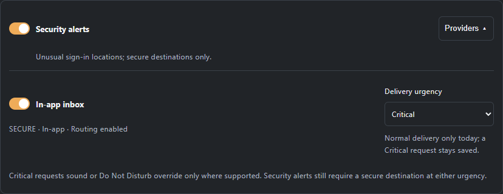
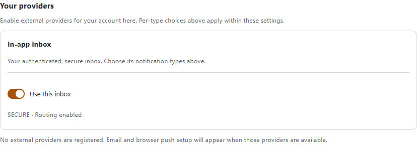

# Notification centre

Open **Notifications** to view your saved inbox. The bell and navigation badge show the full unread total, including notices outside the current page.

Use the category tabs, search field and source selector to narrow the inbox. Results load in pages; **Load more** keeps the current filters. Related notices from the same source, type and security context can be expanded together. **Read these updates** marks the displayed members read; members on other pages remain independent.

Expand a notice to see its message, source and exact event time. Read/unread changes stay with your account. **Dismiss** hides it from the inbox while external delivery continues. **Delete** removes its stored content and cancels unsent delivery work; a send already in progress may finish. Minimal deduplication records keep deleted events from returning.

Temporary plugin reminders are listed separately. They are plugin shortcuts, not saved notifications, and do not contribute to the durable unread total. Browser notifications are also separate from the inbox.

## Preferences and history

Open **Settings → Account → Notifications** or use the centre's **Notification settings** link. Configured providers come first, followed by notification types and inbox history. Calendar preferences have their own page. Followed-media filters live inside the relevant type's expansion, with one type switch and one routing configuration. Game release and unusual sign-in alerts have working host producers. Game sale/price-target controls appear only after a connected source emits live observations; a game's recorded purchase price is not a feed.

Each notification type has an on/off switch and a **Providers** expansion. Inside it, choose individual destinations and **Normal** or **Critical** delivery urgency. Turning off a type keeps these choices. A destination that cannot satisfy the type's trust or server policy is visibly unavailable. Sign-in alerts still require SECURE destinations when delivered as Normal.

Critical is a request for higher transport urgency, such as sound or Do Not Disturb override where supported. It does not change notification sensitivity, verification or permissions. The existing inbox and legacy webhook adapters support normal delivery only; a Critical choice is saved for a compatible provider, with that limitation shown beside the control.

**Your providers** controls external provider enrollment for your account and whether each existing destination is used. Inactive destinations and routing choices remain visible after removal; reinstall does not reclaim them automatically. The legacy webhook uses administrator configuration and generic public release facts. This section does not expose its credentials or pretend that it is a personal, verified endpoint. Personal endpoint enrollment and richer webhook consent follow in the provider work.

Choose **Server default** or your own inbox duration, including **6 months**, **1 year** and unlimited history where allowed. The page shows the effective duration and any server maximum. A previous longer choice stays saved even when an administrator caps it; the cap is visible. New accounts inherit the server default. Existing saved choices remain overrides.

Administrators set `NOTIFICATION_RETENTION_DEFAULT_DAYS` (default 30) and `NOTIFICATION_RETENTION_MAXIMUM_DAYS` (default 0, no maximum) through deployment configuration. Zero for the default means unlimited history. A finite maximum also caps an unlimited choice. Inbox expiry does not cancel external work: content required by pending deliveries remains until those deliveries finish or expire, while it is hidden from the inbox. Explicit deletion has stronger cancellation behavior.

See [notification providers](notification-providers.md) for the existing external-delivery compatibility boundary.
