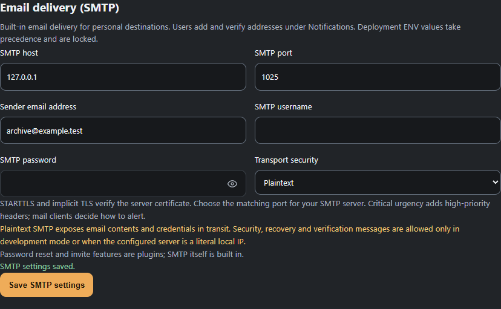
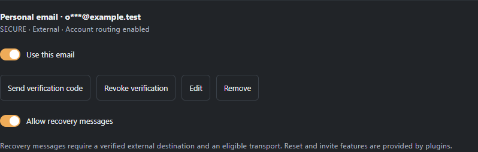

# Notification providers

The authenticated in-app inbox and external deliveries are separate destinations. Marking a notification read or dismissing it changes the inbox; it does not cancel external work. Deleting it cancels unsent work and removes its stored content. A delivery already in progress may finish.

External providers are optional. Plugin providers also need an active installation and permission grant. **Settings → Notifications → Your providers** controls account participation and personal destinations; each notification type expands into destination and Normal/Critical choices.

## Built-in email

Administrators configure SMTP under **Settings → Server → Integrations → Email delivery** or through the existing ENV handler. SMTP is built into the host. Password reset and invitation features remain plugins; adding SMTP does not install those features.

| ENV name | Meaning |
| --- | --- |
| `SMTP_HOST` | Server hostname or literal IP. |
| `SMTP_PORT` | Port, default 587. |
| `SMTP_FROM_ADDRESS` | Single sender email address. |
| `SMTP_USERNAME` | Optional authentication username. |
| `SMTP_PASSWORD` | Optional authentication password; database values are encrypted and never returned. |
| `SMTP_TLS_MODE` | `starttls` (default), `ssl` for implicit TLS, or `none`. |

ENV values take precedence and cannot be replaced from the UI. STARTTLS and implicit TLS verify the server certificate. Plaintext displays a warning and can deliver ordinary notices. Security, recovery and verification messages require TLS except in `STARTUP_MODE=development` or when the configured SMTP endpoint is a literal loopback, RFC1918 IPv4 or IPv6 unique-local address. A hostname resolving to a local address does not grant this exception; testing mode alone does not grant it.

Add one or more personal email addresses under **Your providers → Email (SMTP)**. Addresses start PRIVATE and may receive ordinary notifications. Use **Send verification code**, then enter the eight-digit code from that email. Codes expire in ten minutes, allow five incorrect attempts and are single-use. Resends are limited to one per minute per destination and ten requests per hour per user. Codes travel only to the selected email, never to the in-app inbox or another destination.

Successful verification makes that exact address revision SECURE until it changes or verification is revoked. **Allow recovery messages** is a separate opt-in for a verified external destination; it does not create a password-reset feature. Editing a label keeps proof. Replacing an address or revoking verification clears proof and recovery eligibility and suppresses pending deliveries. Removing an address also erases its encrypted configuration; retained history and routing choices cannot reclaim it through a new enrollment.

Normal is the default urgency. Critical email adds high-priority headers; the mail client decides whether to alert differently. Urgency never changes trust or sensitive-delivery eligibility.

## Plugin providers

An existing Discord webhook is a PUBLIC destination. It can receive generic release facts, including the library's release title. It cannot receive personal selection/following details, account identifiers, watch history/status, ratings or security notices. The compatibility bridge does not treat a configured webhook as verified or as consent for richer announcements.

Save the webhook through the plugin's secret field, then explicitly enable the provider preference. Changing a stored plugin secret disables affected webhook destinations and suppresses their queued routing work; enable them again after configuration is complete. Uninstall preserves history and inactive preferences, but reinstall does not automatically reactivate old destinations.

Delivery is best-effort. The core persists attempts and retries transport failures up to three times. Removing or revoking a provider stops eligible queued work. A temporary runtime outage delays work until it is available or the notification's delivery validity expires.

The inbox defaults to 30 days of history. Retention preferences also support 180 and 365 days, or unlimited retention. Minimal deduplication receipts outlive notification content so old events do not reappear after deletion or retention cleanup.

The [notification centre](notification-centre.md) provides paginated inbox filtering, grouped presentation and explicit retention controls. The shared plugin bridge remains a PUBLIC legacy webhook; personal webhook enrollment and browser push are separate provider work.
