# Notification providers

The authenticated in-app inbox and external deliveries are separate destinations. Marking a notification read or dismissing it changes the inbox; it does not cancel external work. Deleting it cancels unsent work and removes its stored content. A delivery already in progress may finish.

External providers are optional. Plugin providers also need an active installation and permission grant. **Settings → Account → Notifications** starts with your configured providers and personal destinations, followed by notification types and Normal/Critical routing choices. Calendar settings are separate. Only implemented sources appear; price observation controls appear after a connected source emits an observation for your account.

## Built-in email

Administrators configure SMTP under **Settings → Administration → Notifications → Email delivery** or through the existing ENV handler. SMTP is built into the host. Password reset and invitation features remain plugins; adding SMTP does not install those features.

| ENV name | Meaning |
| --- | --- |
| `SMTP_HOST` | Server hostname or literal IP. |
| `SMTP_PORT` | Optional custom port; unset selects 465 for implicit TLS, 587 for STARTTLS, or 25 for plaintext. |
| `SMTP_FROM_ADDRESS` | Single sender email address. |
| `SMTP_USERNAME` | Optional authentication username. |
| `SMTP_PASSWORD` | Optional authentication password; database values are encrypted and never returned. |
| `SMTP_TLS_MODE` | `starttls` (default), `ssl` for implicit TLS, or `none`. |

ENV values take precedence and cannot be replaced from the UI. STARTTLS and implicit TLS verify the server certificate. Plaintext displays a warning and can deliver ordinary notices. Security, recovery and verification messages require TLS except in `STARTUP_MODE=development` or when the configured SMTP endpoint is a literal loopback, RFC1918 IPv4 or IPv6 unique-local address. A hostname resolving to a local address does not grant this exception; testing mode alone does not grant it.

The port follows transport security until you edit it. A saved custom port stays fixed when security changes. **Use default port**, then save, restores automatic selection. Existing explicitly stored ports are preserved as custom values. ENV-managed ports remain locked.

Add one or more personal email addresses under **Your providers → Email (SMTP)**. The initial address is your configured app email; you can enter another address. Prefilling an address does not enroll or verify it. Addresses start PRIVATE and may receive ordinary notifications. Request a verification email, then either open **Verify this email** and confirm, or enter its eight-digit code in settings. Links and codes share the same ten-minute, single-use challenge. Opening the link does not consume it, sign you into the app, or enable recovery routing. An address change, revoked challenge or successful code/link invalidates the other method. Codes allow five incorrect attempts. Resends are limited to one per minute per destination and ten requests per hour per user. Proof travels only to the selected email, never to another destination. When no usable app URL exists, code entry remains available.

### Test delivery

Save SMTP settings, then enter a **Test recipient** and click **Send test email**. It defaults to the administrator's configured app email and uses the effective saved/ENV host, transport, sender and credentials. The fixed example contains no user activity or recovery secrets. The result reports SMTP acceptance or a sanitized transport failure; acceptance does not guarantee inbox placement. Test recipients are not enrolled or verified, and tests omit unsubscribe headers.

Personal destinations have **Send test notification** controls. These queue the same generic example through the central dispatcher and target only that destination. Disabled preferences/providers still prevent delivery; test work does not leak into your other destinations. An inbox test appears in the inbox. Requests are limited to ten per account per hour; attempts, including failed SMTP diagnostics, count toward this limit.

Successful verification makes that exact address revision SECURE until it changes or verification is revoked. **Allow recovery messages** is a separate opt-in for a verified external destination; it does not create a password-reset feature. Editing a label keeps proof. Replacing an address or revoking verification clears proof and recovery eligibility and suppresses pending deliveries. Removing an address also erases its encrypted configuration; retained history and routing choices cannot reclaim it through a new enrollment.

Normal is the default urgency. Critical email adds high-priority headers; the mail client decides whether to alert differently. Urgency never changes trust or sensitive-delivery eligibility.

## Email unsubscribe

Notification links follow destination URL preference → personal notification URL → shared public app URL → your last-used app origin. Configure your preferences under **Settings → Notifications → Notification links**; blank overrides inherit the default. Configure the shared URL under **Settings → Administration → Application**, setup, or `PUBLIC_APP_URL` through the existing ENV handler. That shared value must use HTTPS and a public fully qualified domain name. Its public DNS is managed by the administrator. The app remembers each user's origin when they open it while signed in, including a local IP or different domain. API-key/plugin traffic cannot change it. All of these URLs are independent of OIDC sign-in callbacks. Ordinary email receives no unsubscribe link until at least one usable URL exists.

Ordinary notification emails include a `List-Unsubscribe` header and a short linked footer in the HTML version. The plain-text version keeps the original notification body; the header retains the complete opt-out URL. Mail clients may offer an Unsubscribe command. Opening the link displays a confirmation page without changing settings. Click **Unsubscribe from this type** to stop only the notification type named on that page for this email destination. Other notification types, security/recovery routes, your inbox, other addresses and history stay active. Matching queued work is suppressed; a send already in progress may finish.

The separate **Stop all email notifications to this destination** button also stops its security/recovery routes. These confirmation actions require no login. **Review other subscriptions** opens Account Notifications after signing in, where you can change individual routes or re-enable them. Older links created before type-scoped unsubscribe clearly offer only the all-email action.

Links expire after 90 days. Changing/removing the address invalidates its old links. Type-only unsubscribe keeps the address active, its verification proof and your Normal/Critical choice. All-email unsubscribe preserves same-address verification; reactivating the destination in Settings invalidates its old links. Verification, recovery and security emails are transactional and omit subscription headers and footers.

This is confirmation-based header support, not RFC 8058 one-click. `List-Unsubscribe-Post` is not advertised. Display of a mail-client unsubscribe button also depends on the client's policies and the SMTP relay's authentication configuration.

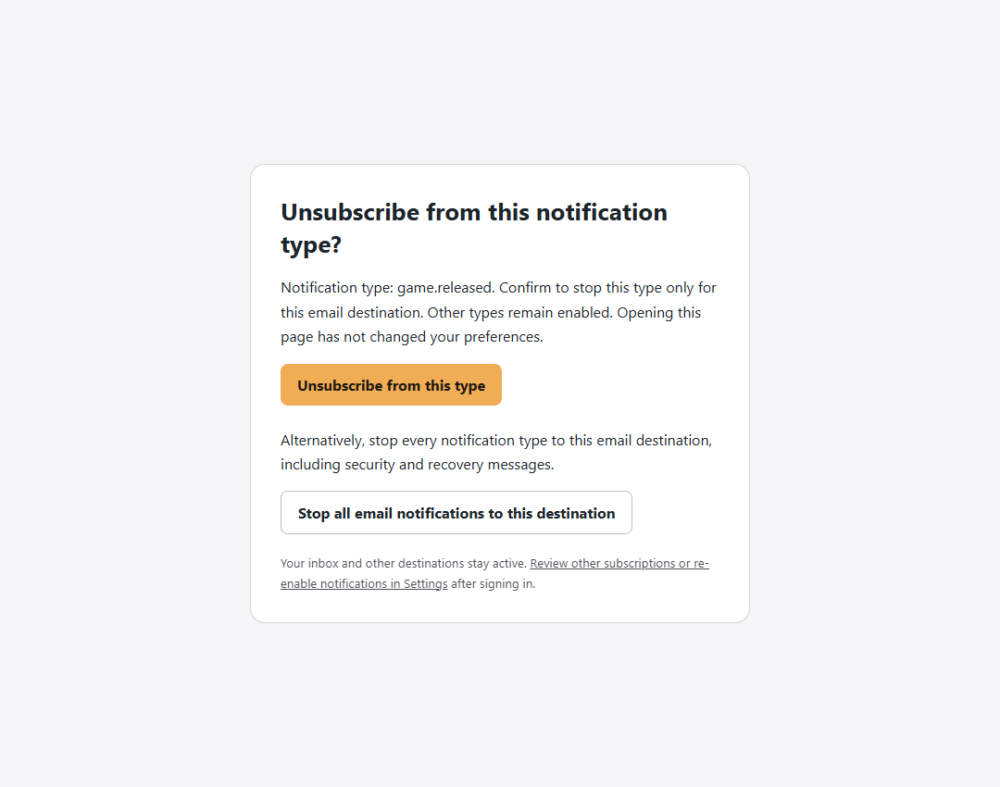

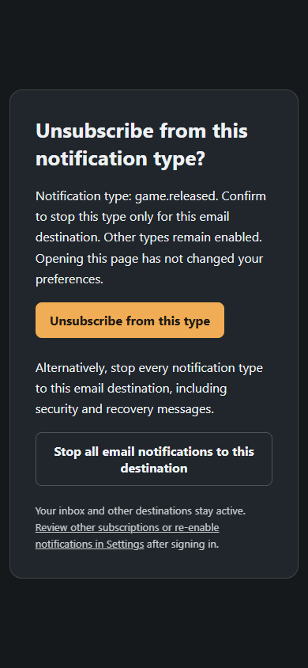

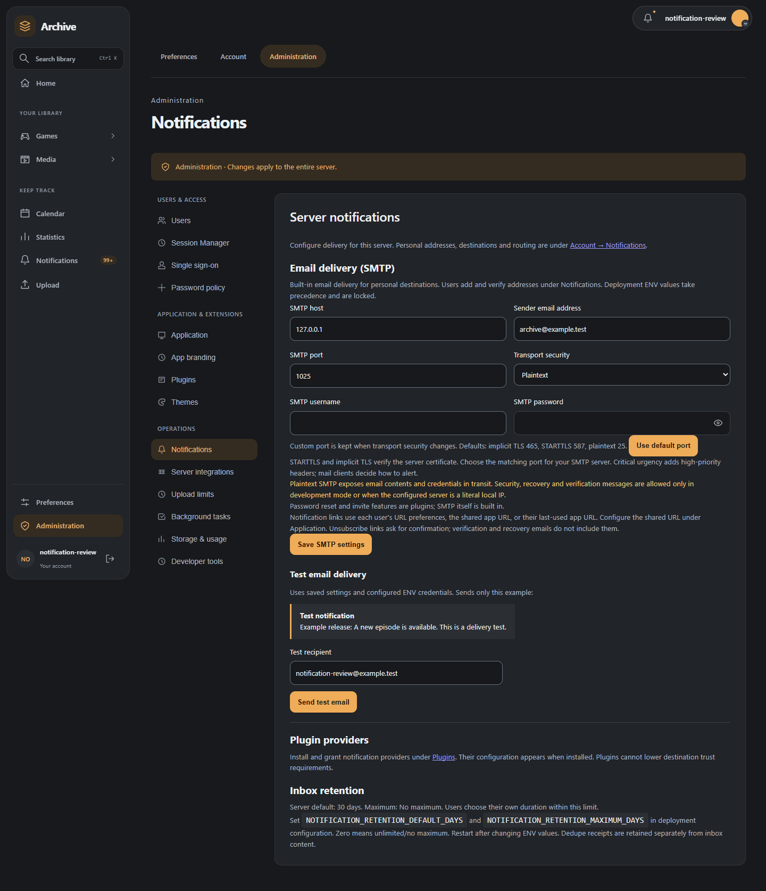

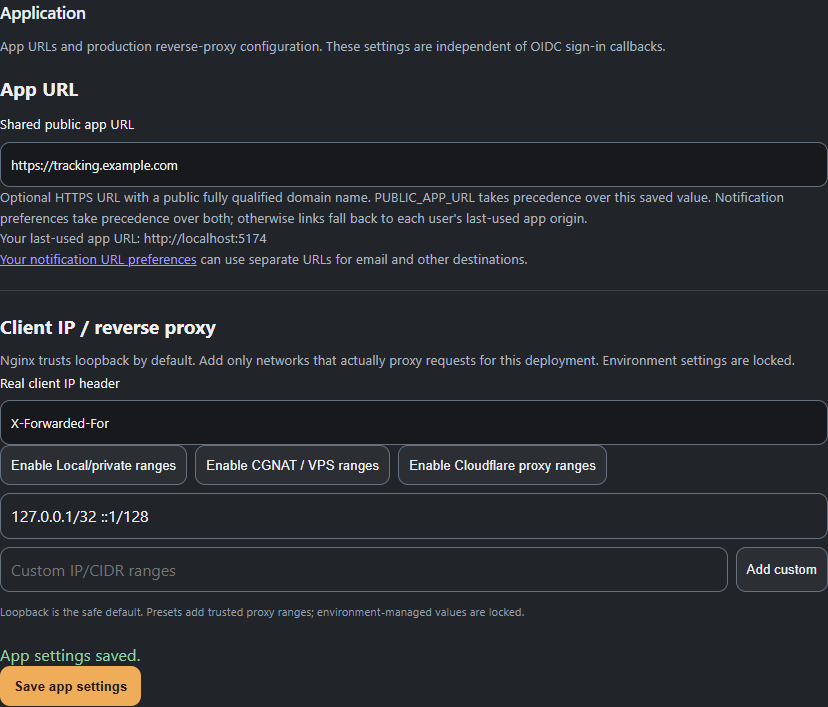

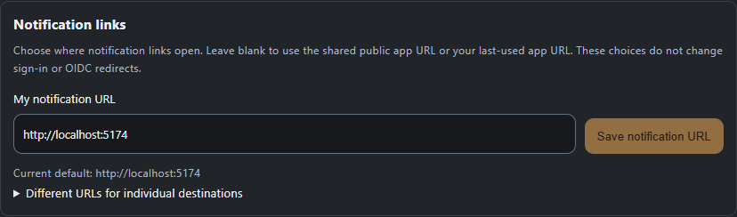

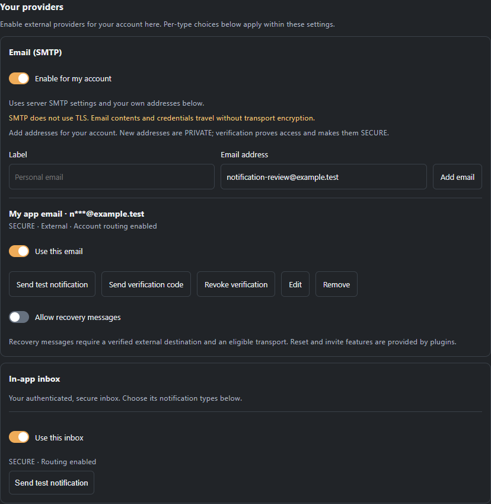

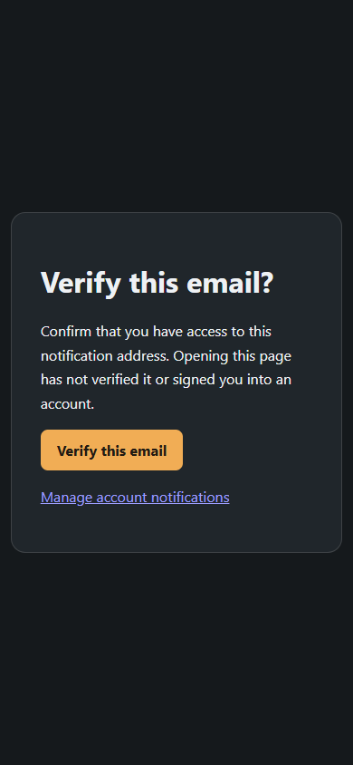

## Discord webhooks

The maintained companion plugin **Discord Notifications** (`official.discord-notifications`)
uses protected host delivery. Install and approve its provider permissions, then
add webhooks under **Account → Notifications → Your providers → Discord**. The
signed official 1.0.0 release is available in the companion catalogue;
use a compatible host implementing the protected Plugin API 1.1.2 contract.
Administrators must permit Discord egress in the existing plugin runtime.

Add a label and an ordinary Discord HTTPS webhook. Each concrete webhook is
PUBLIC, and its token is encrypted by the app; plugins and settings responses
never receive it. Multiple webhooks have independent preferences and consent.
Configured destinations appear first; inactive history can be expanded separately.
Use **Send test notification** to queue a generic example to that destination.
Forum threads and Discord DMs are not supported in this increment.

The default is a generic release announcement, including the release title and
public release facts. **Choose richer media sharing** presents an explicit
confirmation for that one webhook: title, season/episode/release facts and the
fact that you selected/followed it. Artwork is not sent yet. Account identifiers,
watch history/status, ratings, private price targets, security messages and
recovery tokens remain excluded. Confirmation never promotes webhook trust.

Disabling a webhook clears its consent and cancels unsent work. Re-enabling it
never replays old messages. Editing its label preserves the endpoint; replacing
its URL requires removing it and adding a new webhook with fresh consent.
Removal erases credentials while preserving history and routing choices.
Provider/plugin disable and grant revocation retire affected destinations;
same-installation reactivation is explicit. Reinstallation needs new enrollment
and cannot reclaim old credentials or consent.

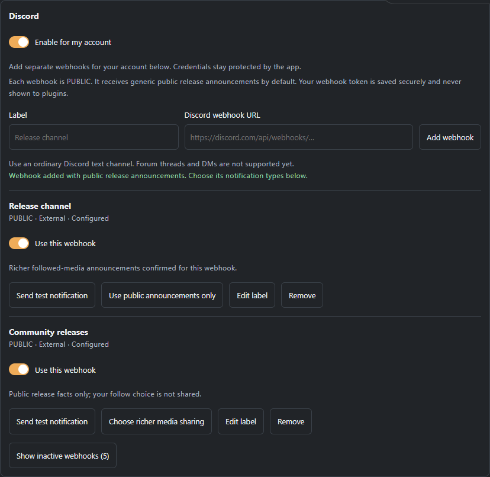

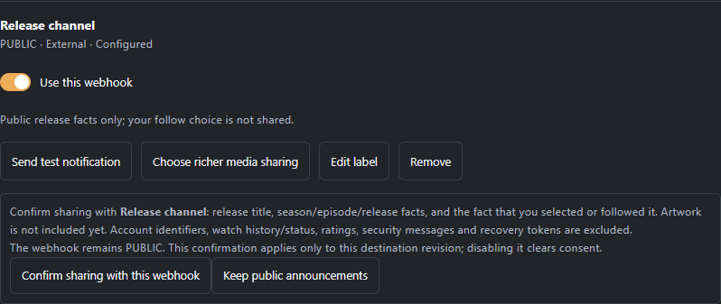

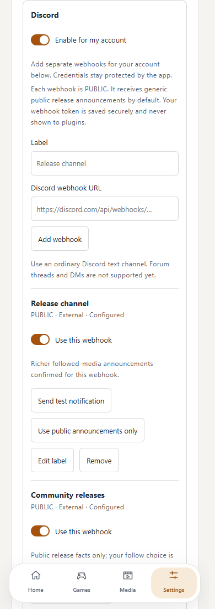

### Legacy plugin compatibility

Existing shared-secret plugin registrations retain the PUBLIC compatibility
bridge. Save their webhook through their plugin secret field and enable the
provider preference. Changing a legacy secret disables its endpoints and queued
work. That storage is readable by the legacy plugin; it is not the protected
host vault. Credentials and richer consent are never transferred to the new ID.

Delivery is best-effort. The core persists attempts and retries transport failures up to three times. Removing or revoking a provider stops eligible queued work. A temporary runtime outage delays work until it is available or the notification's delivery validity expires.

The inbox defaults to 30 days of history. Retention preferences also support 180 and 365 days, or unlimited retention. Minimal deduplication receipts outlive notification content so old events do not reappear after deletion or retention cleanup.

The [notification centre](notification-centre.md) provides paginated inbox filtering, grouped presentation and explicit retention controls. Browser/PWA push remains separate from the in-app inbox; configure it as described below.

## Browser / PWA push

Administrators enable the existing PWA plugin and its `frontend.pwa` permission,
then configure **Administration → Notifications → Browser delivery**. Set an explicit
`mailto:` address or HTTPS server contact and generate a missing application key.
ENV deployments can instead provide `WEB_PUSH_VAPID_SUBJECT` and
`WEB_PUSH_VAPID_PRIVATE_KEY` (base64 DER P-256). Saved keys are encrypted and write-only.
Keep the key stable: replacement/removal disables existing browser destinations and
requires users to enroll again. ENV-owned configuration stays locked.

Under **Account → Notifications → Your providers → Browser / PWA push**, enable
account routing, give this browser a label and choose **Enable on this browser**.
Allow the native browser permission. HTTPS is required outside localhost; on iPhone
and iPad, install the app on the home screen first. Each browser has its own PRIVATE
external destination. This never upgrades its trust or enables password resets,
security-sensitive content or recovery secrets. Push uses Normal urgency.

**Send test** queues a generic example to the selected browser through ordinary delivery
state and retries. Keep its enrolled session signed in; the existing job tick may take
a minute. Initial push services supported are Chromium/FCM, Mozilla, Apple and Windows
notification hosts. Other/self-hosted push endpoints are rejected.

Every preview says **New notification — Open Unnamed Tracking to view your
notifications.** It contains no media/activity detail. The app must be reachable and
the enrolled session eligible before a preview is displayed. Clicking opens this
browser's own-origin notification centre; personal/destination link overrides do not
change it. Browser permission, operating-system settings and the push service may
suppress or delay delivery. There is no guarantee that the device displays an alert.

Use the destination toggle to pause future delivery, or **Remove browser** to erase its
subscription and cancel pending work. Signing out, switching accounts, session expiry,
PWA disable/permission withdrawal, subscription expiry or key replacement requires fresh
enrollment. Previous destinations remain inactive history. Re-enabling account delivery
never replays notices created while it was off. The authenticated inbox remains independent.

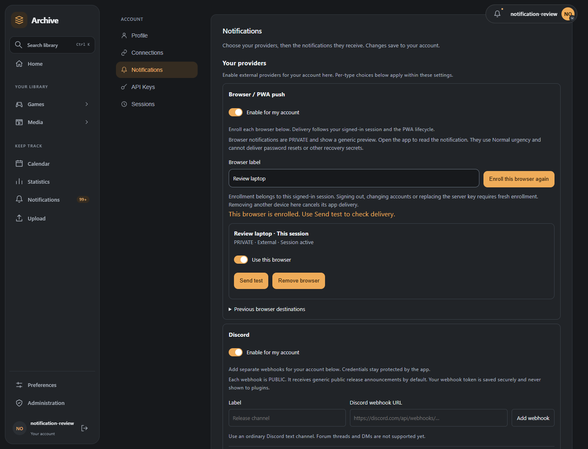

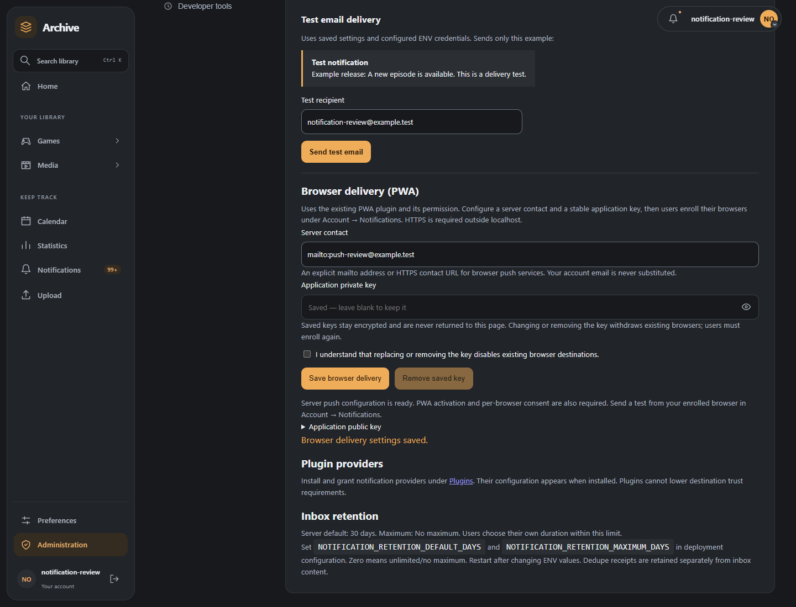

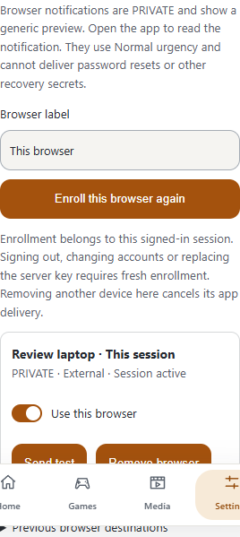
